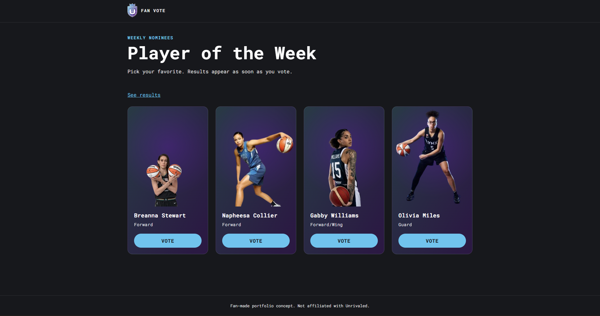
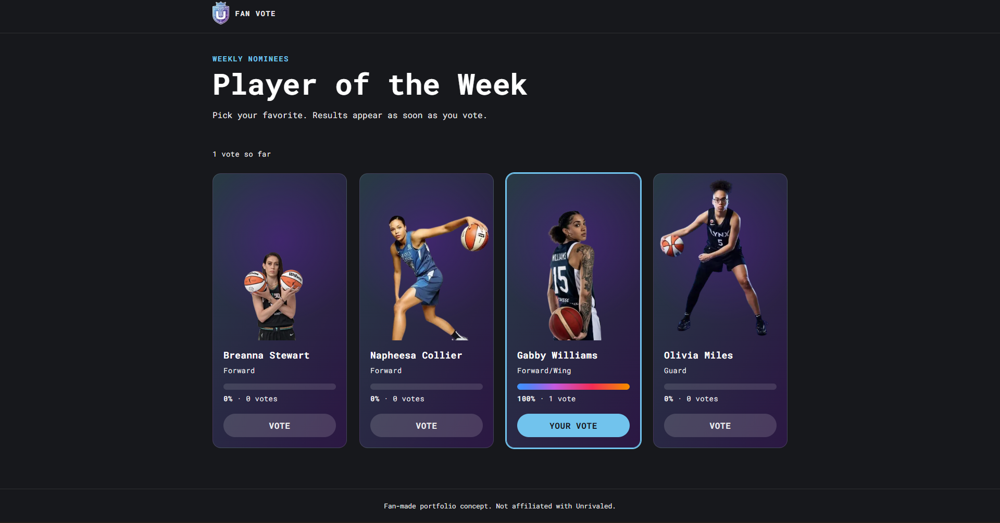

# Player of the Week: Fan Vote

A fan-voting page for Player of the Week. Built with Next.js, Prisma, and PostgreSQL.

**Live demo:** https://player-of-the-week-vote.vercel.app

> This project is a conceptual demo created solely for portfolio and interview
> purposes. It was built as a self-directed learning exercise and is not affiliated
> with or endorsed by Unrivaled Basketball. All logos and branding belong to
> Unrivaled. Player names and images belong to their respective owners.

| Before voting | After voting |
| --- | --- |
|  |  |

## About

I built this as a portfolio piece for a Jr. Software Engineer application. It
focuses on the fan-facing, full-stack side of the job: a React front end, API
routes with validation, and a real relational database.

Anyone can vote with no login, and results appear the moment a vote is cast.

## Features

- Player cards with photos and a live percentage bar per player that fills in after voting
- Results stay hidden until you vote, with an optional "See results" toggle
- One-vote-per-browser lock that survives page refreshes
- API validation: malformed requests and unknown players are rejected with clear status codes
- Responsive layout from small phones to wide desktops, with no horizontal scrolling
- Accessible: semantic HTML, labeled buttons, `progressbar` roles with text equivalents,
  a live-region announcement when a vote is recorded, visible focus styles, and
  reduced-motion support

## Tech stack

| Area | Choice |
| --- | --- |
| Framework | Next.js 16 (App Router), React 19, TypeScript |
| Database | PostgreSQL on Supabase |
| ORM | Prisma 7 with the `@prisma/adapter-pg` driver adapter |
| Styling | Plain CSS Modules and CSS custom properties (no UI library) |
| Hosting | Vercel |

## Data model

A real one-to-many relationship, not a single counter column:

- `candidates`: `id`, `name`, `description`, `image_url`
- `votes`: `id`, `candidate_id` (foreign key to `candidates`), `created_at`

Percentages are computed from vote counts on each request, so adding a player is
a new database row and needs no code change.

## API

| Route | Purpose | Responses |
| --- | --- | --- |
| `GET /api/results` | Candidates with vote counts and percentages | `200`, `500` |
| `POST /api/votes` | Record one vote and return updated results | `201`, `400` (bad body or non-integer id), `404` (unknown candidate), `500` |

The vote route never trusts the client: it checks that the body is valid JSON,
that `candidateId` is a whole number, and that the candidate exists before
anything is written.

## Design decisions and limitations

- **No login or subscription gate.** Anyone can vote and see live results.
- **The vote lock is a convenience, not security.** It uses `localStorage`, so a
  determined visitor can vote again by clearing it or using another browser.
  Real duplicate prevention would need server-side checks, such as authentication
  or rate limiting.
- **Row Level Security is enabled** on all tables with no public policies, so
  Supabase's auto-generated public API returns nothing. The app reads and writes
  through Prisma on a server-only connection.
- **Prisma is pinned to 7.x.** The 8.0 release candidate changes the schema
  workflow, so I stayed on the stable version.
 - **Environments.** Database credentials live in Vercel environment variables
  (stored as secrets) for Production and Preview, and in a git-ignored `.env`
  file locally. Preview builds of pull requests use the same database as
  production, which is fine for a small solo project; a larger team would give
  previews their own database.

## Run it locally

You need Node 20 or newer and a PostgreSQL database (a free Supabase project works).

1. Install dependencies:

```bash
   npm install
```

2. Create a `.env` file in the project root:

```
   DATABASE_URL="postgresql://..."   # pooled connection, used by the running app
   DIRECT_URL="postgresql://..."     # direct connection, used by Prisma CLI commands
```

3. Generate the Prisma client, create the tables, and add the sample players:

```bash
   npx prisma generate
   npx prisma migrate deploy
   npx tsx prisma/seed.ts
```

4. Start the dev server and open http://localhost:3000:

```bash
   npm run dev
```

`npm run build` runs `prisma generate` before `next build`, so Vercel builds work
from a fresh checkout.

## Workflow

Built with feature branches and pull requests merged into `main`. See the closed
pull requests for the step-by-step history.

## Possible next steps

- Server-side duplicate prevention (authentication or rate limiting)
- A weekly voting window with scheduled resets
- Automated tests for the API routes
- Admin tooling to manage candidates
